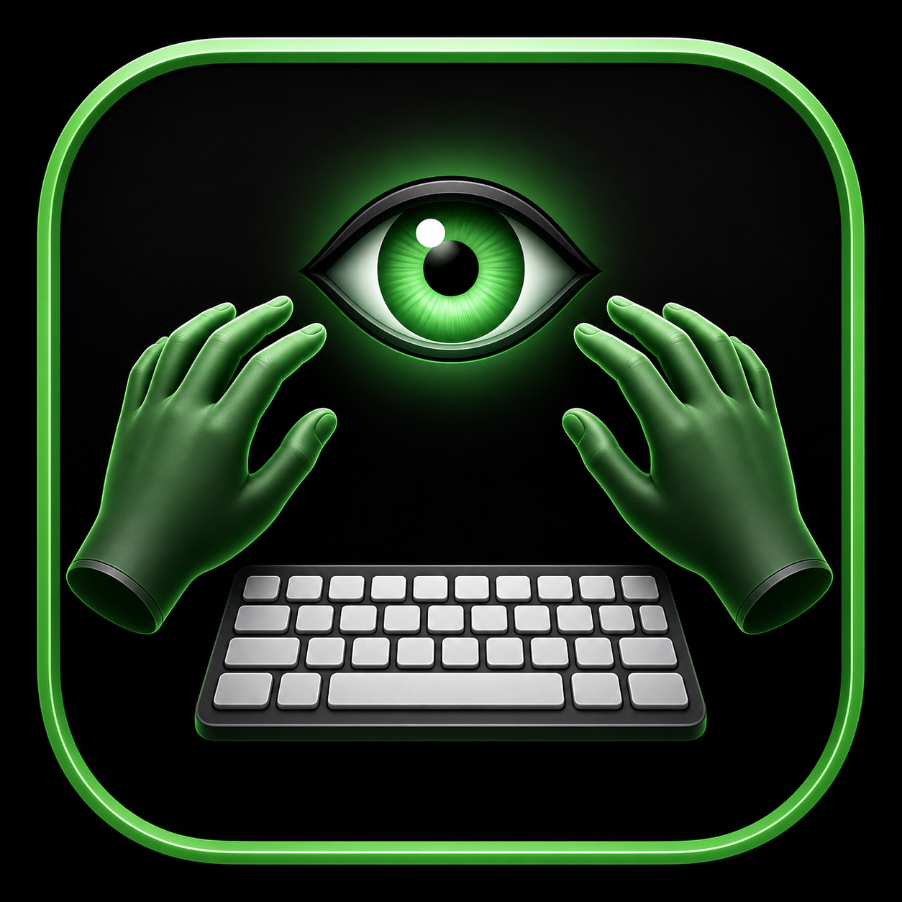

# Apprenti Clavier

Apprenti Clavier est une application macOS destinée à l’apprentissage progressif de la frappe au clavier AZERTY.

Elle a été conçue pour être utilisable aussi bien par les personnes utilisant VoiceOver que par les personnes n’utilisant pas de lecteur d’écran.

## Apprendre progressivement

L’apprentissage est organisé en modules et en leçons afin de découvrir le clavier étape par étape.

La version 1.0 permet notamment de travailler les trois rangées de lettres du clavier AZERTY, puis de les consolider grâce à des exercices de révision.

Les leçons proposent des explications sur le placement des doigts, des exercices de saisie et un résumé de progression.

## Accessibilité

L’accessibilité fait partie intégrante d’Apprenti Clavier.

L’application est conçue pour fonctionner avec VoiceOver et propose notamment :

- des intitulés et des annonces adaptés au lecteur d’écran ;
- une navigation pensée pour être utilisée au clavier ;
- une annonce facultative du texte restant à taper ;
- plusieurs délais d’annonce sélectionnables ;
- une interface utilisable sans lecteur d’écran ;
- une apparence automatique, claire ou sombre.

## Profils et progression

Apprenti Clavier permet de créer plusieurs profils.

Chaque profil possède sa propre progression. Les profils peuvent être exportés et importés afin de sauvegarder leur contenu ou de les utiliser sur un autre Mac.

Une fenêtre de statistiques permet également de consulter et d’exporter les statistiques du profil actif.

## Configuration requise

Apprenti Clavier nécessite macOS 12 Monterey ou une version ultérieure.

L’application est prévue pour les Mac équipés d’un processeur Intel ou Apple Silicon.

## Télécharger Apprenti Clavier

Les versions publiques d’Apprenti Clavier sont proposées dans la section « Releases » de ce dépôt GitHub.

Lorsqu’une version est disponible, téléchargez le fichier DMG correspondant, puis ouvrez-le pour accéder à l’application.

## Documentation

Un Guide utilisateur accompagne Apprenti Clavier et présente en détail l’installation, les profils, les modules, les exercices, les réglages, les statistiques, les raccourcis utiles et les solutions aux problèmes les plus courants.

## Projet d’origine

Apprenti Clavier pour macOS est une adaptation inspirée du projet libre ApprentiClavier.

## À propos de ce projet

Je suis moi-même déficient visuel et j’ai utilisé sous Windows le logiciel libre ApprentiClavier, dont cette application s’inspire.

Souhaitant disposer d’une solution similaire, accessible sur Mac et pensée notamment pour une utilisation avec VoiceOver, j’ai entrepris de créer Apprenti Clavier pour macOS.

Ce projet est avant tout une activité personnelle réalisée sur mon temps libre. Je ne suis pas développeur professionnel. Pour concevoir et développer Apprenti Clavier, je me suis notamment appuyé sur des outils et des agents d’intelligence artificielle, qui m’ont accompagné dans la réalisation technique de l’application. Le projet est né de mon expérience d’utilisateur, de mes besoins en matière d’accessibilité et de mon envie de proposer à d’autres utilisateurs une solution qui puisse leur être utile.

J’espère que l’application pourra répondre à vos besoins et vous accompagner agréablement dans l’apprentissage du clavier.

Les signalements de problèmes et les suggestions sont les bienvenus. Je ferai mon possible pour y répondre et améliorer l’application lorsque cela m’est possible. Toutefois, n’étant pas développeur professionnel, je ne peux pas garantir de pouvoir apporter une assistance technique approfondie ni résoudre tous les problèmes rencontrés.

## Contact

Pour signaler un problème ou transmettre une suggestion, vous pouvez utiliser les options de contact intégrées à l’application.

Adresse de contact : contactdevapcb@gmail.com

## Licence

Apprenti Clavier est publié sous licence GNU GPL version 2.

© 2026 Aurélien Reffay
